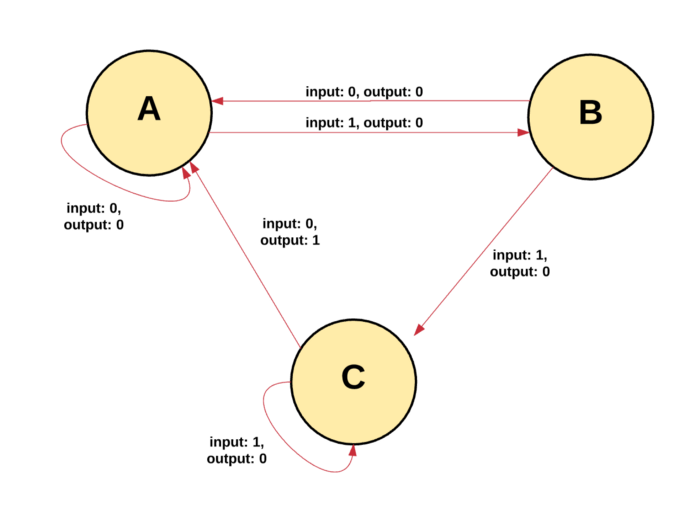
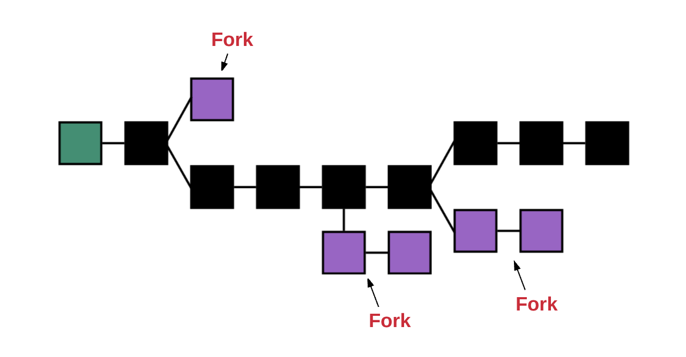

# Solidity
# Day 3: Intro to Ethereum and its terminologies
## Introduction
Odds are you’ve heard about the Ethereum blockchain, whether or not you know what it is. It’s been in the news a lot lately, including the cover of some major magazines, but reading those articles can be like gibberish if you don’t have a foundation for what exactly Ethereum is. So what is it? In essence, it's a public database that keeps a permanent record of digital transactions. Importantly, this database doesn’t require any central authority to maintain and secure it. Instead, it operates as a “trustless” transactional system — a framework in which individuals can make peer-to-peer transactions without needing to trust a third party OR one another.

Still confused? That’s where this post comes in. My aim is to explain how Ethereum functions at a technical level, without complex math or scary-looking formulas. Even if you’re not a programmer, I hope you’ll walk away with at least a better grasp of the tech. If some parts are too technical and difficult to grasp, that’s totally fine! There’s really no need to understand every little detail. I recommend just focusing on understanding things at a broader level.

Many of the topics covered in this post are a breakdown of the concepts discussed in the yellow paper. I’ve added my own explanations and diagrams to make understanding Ethereum easier. 

## Blockchain Definition
1. A blockchain is a “cryptographically secure transactional singleton machine with shared-state.” [1] That’s a mouthful, isn’t it? Let’s break it down.

2. “Cryptographically secure” means that the creation of digital currency is secured by complex mathematical algorithms that are obscenely hard to break. Think of a firewall of sorts. They make it nearly impossible to cheat the system (e.g. create fake transactions, erase transactions, etc.)
3. “Transactional singleton machine” means that there’s a single canonical instance of the machine responsible for all the transactions being created in the system. In other words, there’s a single global truth that everyone believes in.
4. “With shared-state” means that the state stored on this machine is shared and open to everyone.
Ethereum implements this blockchain paradigm.

## The Ethereum blockchain paradigm explained
The Ethereum blockchain is essentially a transaction-based state machine. In computer science, a state machine refers to something that will read a series of inputs and, based on those inputs, will transition to a new state.



With Ethereum’s state machine, we begin with a “genesis state.” This is analogous to a blank slate before any transactions have happened on the network. When transactions are executed, this genesis state transitions into some final state. At any point in time, this final state represents the current state of Ethereum.


The state of Ethereum has millions of transactions. These transactions are grouped into “blocks.” A block contains a series of transactions, and each block is chained together with its previous block.


To cause a transition from one state to the next, a transaction must be valid. For a transaction to be considered valid, it must go through a validation process known as mining. Mining is when a group of nodes (i.e. computers) expend their compute resources to create a block of valid transactions.

Any node on the network that declares itself as a miner can attempt to create and validate a block. Lots of miners from around the world try to create and validate blocks at the same time. Each miner provides a mathematical “proof” when submitting a block to the blockchain, and this proof acts as a guarantee: if the proof exists, the block must be valid.

For a block to be added to the main blockchain, the miner must prove it faster than any other competitor miner. The process of validating each block by having a miner provide mathematical proof is known as a “proof of work.”

A miner who validates a new block is rewarded with a certain amount of value for doing this work. What is that value? The Ethereum blockchain uses an intrinsic digital token called “Ether.” Every time a miner proves a block, new Ether tokens are generated and awarded.

You might wonder: what guarantees that everyone sticks to one chain of blocks? How can we be sure that there doesn’t exist a subset of miners who will decide to create their own chain of blocks?

Earlier, we defined a blockchain as a transactional singleton machine with a shared state. Using this definition, we can understand the correct current state is a single global truth, which everyone must accept. Having multiple states (or chains) would ruin the whole system because it would be impossible to agree on which state was the correct one. If the chains were to diverge, you might own 10 coins on one chain, 20 on another, and 40 on another. In this scenario, there would be no way to determine which chain was the most “valid.”

Whenever multiple paths are generated, a “fork” occurs. We typically want to avoid forks, because they disrupt the system and force people to choose which chain they “believe” in.


To determine which path is most valid and prevent multiple chains, Ethereum uses a mechanism called the “GHOST protocol.”

```“GHOST” = “Greedy Heaviest Observed Subtree”```

In simple terms, the GHOST protocol says we must pick the path that has had the most computation done upon it. One way to determine that path is to use the block number of the most recent block (the “leaf block”), which represents the total number of blocks in the current path (not counting the genesis block). The higher the block number, the longer the path and the greater the mining effort that must have gone into arriving at the leaf. Using this reasoning allows us to agree on the canonical version of the current state.

