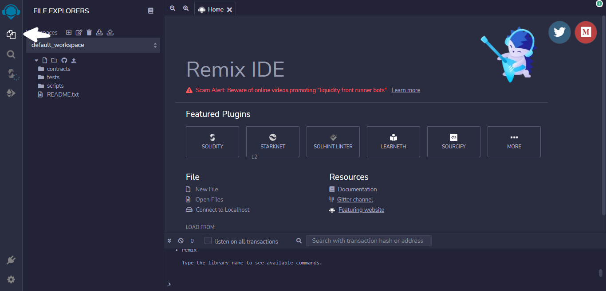
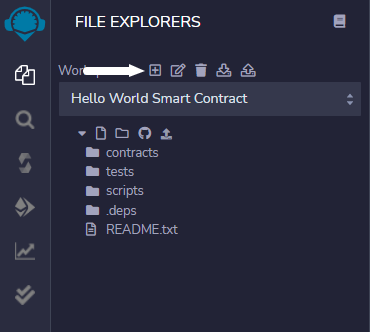
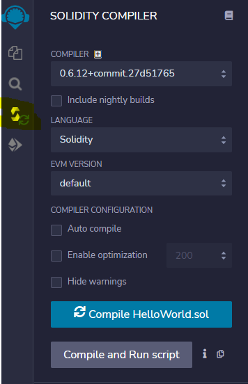
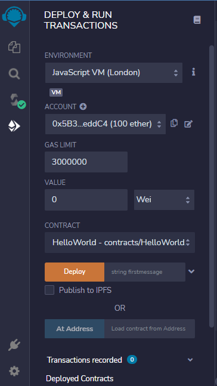
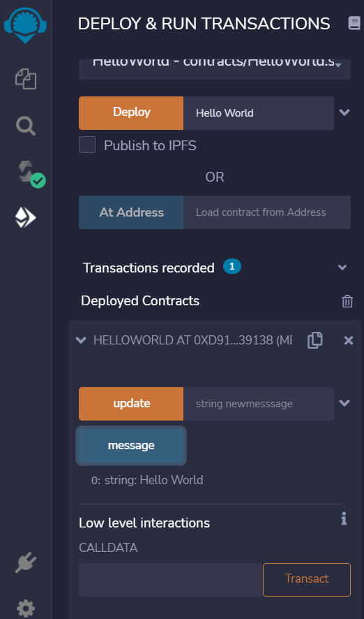

# Solidity
## Day 4: Writing Hello World Contract using remix
 There is a plethora of information and tutorials out there and you are probably confused about not knowing where to start. You are surrounded by all of these exquisite and alien terms which have got you wondering where to start? What IDE I should use? Well, you don't need to worry anymore. This is the guide we wish existed when we first started out writing smart contracts. Regardless of whether you are a complete novice or a seasoned professional, this is the only guide you'll ever need to get started on your first contract. Let's begin by brushing up on some basics regarding some terminology.

## What is Remix IDE?

An IDE is an Integrated Development Environment for enabling the development of smart contracts via Solidity. Does this ring a bell? No? Well, we were in the same boat too back then, but let us simplify some key components. In layman's terms, an IDE is a software for building applications that combines common developer tools into a single GUI. Remix is a popular IDE for Ethereum Smart Contract development written in JavaScript and supports complete testing, deploying, and debugging of all smart contracts. There are a bunch of ways to access Remix:

1. You can either use your browser to access it via https://remix.ethereum.org/
2. You can install it on your system too by clicking the following link
3. The final option is to use the ETH Dapp browser called Mist

Now let's get started with the process you dread the most. This article is all about teaching you how to write your first smart contract, so don't worry we will not hesitate to simplify and elaborate points down to the very basics and fundamentals of how these things operate. In addition to this, keep in mind, that there are no dumb questions, only dumb answers. So don't shy away from expressing your curiosity.

## Getting Started with Writing Your First Hello World Contract

Let us begin now with our ''Hello World'' contract in Remix. We will aim to print and amend "Hello World" on the screen and learn some key aspects about smart contracts on the way. You have to carefully follow the steps below to avoid any additional hassle. Let's get started:

Head over to http://remix.ethereum.org/ on your browser to launch Remix IDE. You will be presented with the following screen:



Click on the file explorer tab indicated by the white arrow in the image above. Select Solidity as the default environment (if prompted) and then click on the plus icon next to the browser (indicated by the white arrowhead)



Name your file as ' 'HelloWorld.sol'' (whereby ".sol" refers to Solidity programs).

For pro engineers who wish to jump directly to the complete code, here's a copy for you:

Now let's formally get started:

Since our Solidity contract is not licenced, it is a good practice to declare it as comment in the first line of code:

```//SPDX-License-Identifier: UNLICENSED```

We then declare the compiler version of Solidity for our contract. As an arbitrary number, we choose greater than 0.8.0

```pragma solidity >= 0.8.0;```

We then declare the name of our contract, "Hello World" as follows:

```contract HelloWorld {}```

We then declare a public variable called "message" of type "string" to hold the most up-to-date value of our message. Ethereum offers a built-in data type called "event" for debugging purposes. It is similar to "console.log" in JavaScript except that it is emitted during transactions on Ethereum and stored in its blockchain. In our case, since we'll be amending the value of our "message" from "Hello World" to "Hello Metaschool" later, it would be a good practice to store the value of our old and new message in an event whenever the value changes

``` 
event messagechanged(string oldmsg, string newmsg);

string public message;
```

A constructor in Solidity is the piece of code that is required and executed at the time of deployment of the contract. We declare our constructor and take a string "firstmessage" as input and assign it to our "message" variable. What this means is that when the contract is deployed, it will ask for an initial message to get started with.

```
constructor(string memory firstmessage) {

message = firstmessage;

}
```
At the time of deploying the contract, we will pass '' Hello World" as the first message so the value of the string public message will become updated.

We now need a means to update the value of our "message" whenever required. For this purpose, we write a function called "update" which takes our "newmessage" as input.

```
function update(string memory newmesssage) public {

}
```
We then declare a temporary variable (notice "memory") to store the value of our current "message". We then update the value of the "message" to the "newmessage" and emit our earlier declared event "messagechanged" to keep a track of changes on the blockchain:

```
function update(string memory newmesssage) public {

string memory oldmsg = message;

message = newmesssage;

emit messagechanged(oldmsg, newmesssage);

}
```

The programming part of our tutorial is now complete. It is time to compile our contract. Click on Solidity Compiler in the left-hand corner (Highlighted in Yellow):



Then without changing any prior setting click on '' Compile HelloWorld.sol''. After successful compilation, click on "Deploy and run transactions" in the navbar below Solidity Compiler:



You don't have to change any settings, just pass in "Hello World" and click "Deploy". You will observe your contract appears in the ''Deployed Contracts Tab''. Our Hello World contract is now deployed on our local Virtual Machine. Time to test it out:

Click on the downward arrow next to your contract and you will see two options, "update" and "message". Click on the "message" to see the latest value stored in our "message variable":

Hello World. Yayy! Now let's use the "update" function and pass in "Hello Metaschool". Fetching the latest value of "message" should now display as follows:



Hello World. Yayy! Now let's use the "update" function and pass in "Hello Metaschool". Fetching the latest value of "message" should now display as follows: